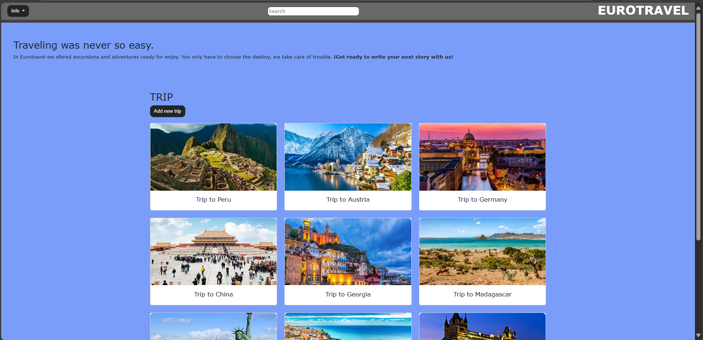
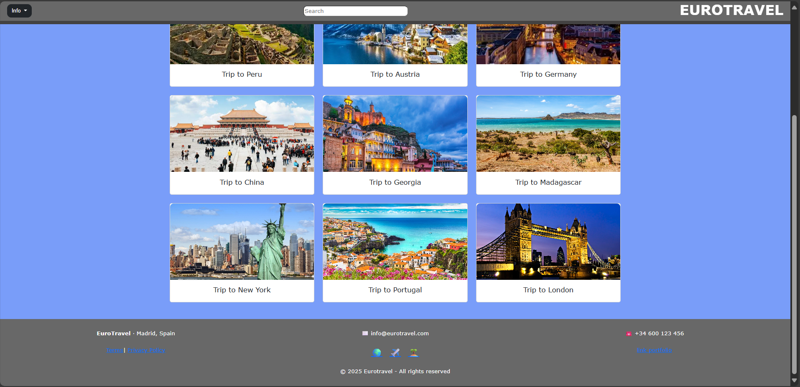
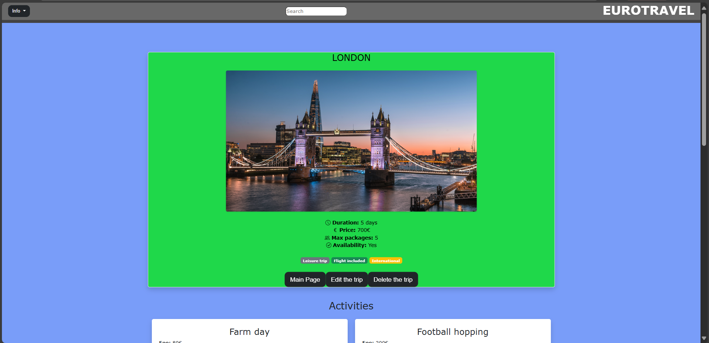
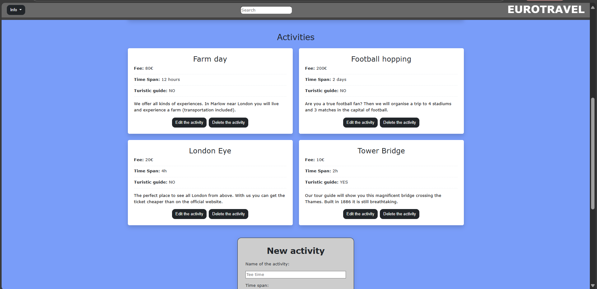
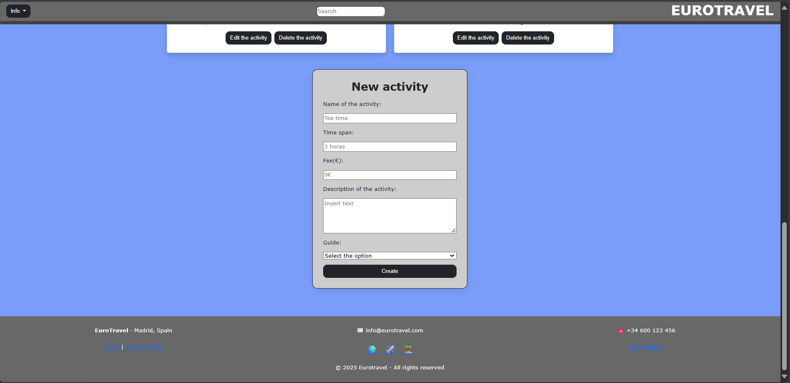
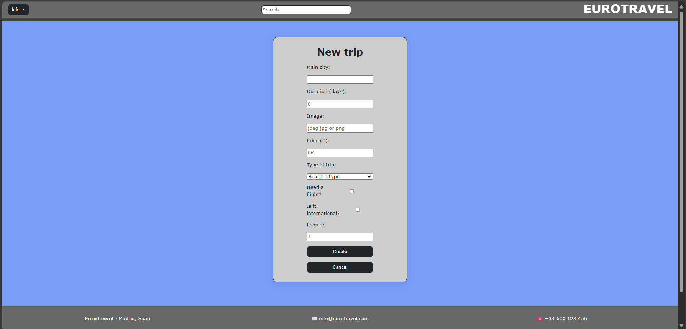
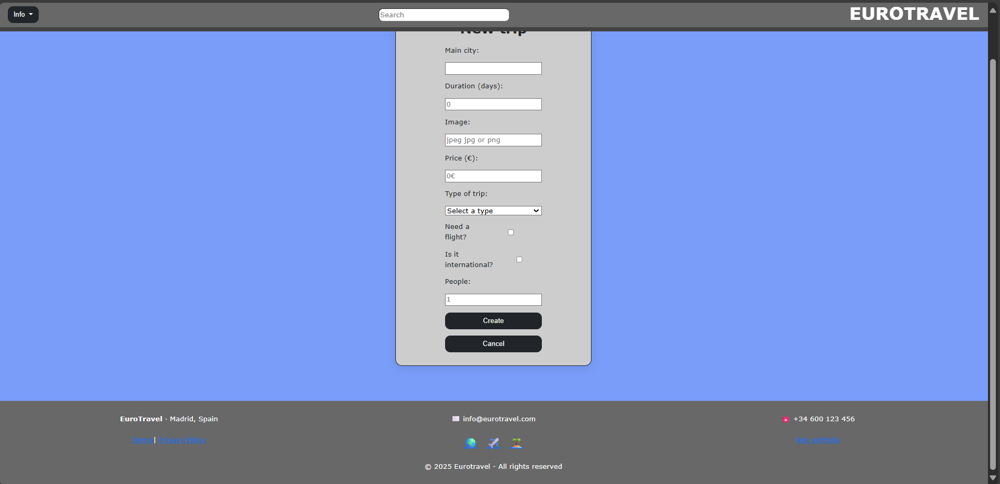

# GoTravel
**Web Fundamentals**  
**2nd Year - Software Engineering Degree**  
**Project 2025 – 2026**

##  Development Team
| Nombre                           | Email                                          | Github Username                         |
|----------------------------------|------------------------------------------------|-----------------------------------------|
| **Raúl Martín Sánchez**          | [r.martinsa.2024@alumnos.urjc.es](mailto:r.martinsa.2024@alumnos.urjc.es) | [@raulmrtnsa](https://github.com/raulmrtnsa) |
| **Stanislaw Cherkhavskyy Pater** | [s.cherkhavskyy.2024@alumnos.urjc.es](mailto:s.cherkhavskyy.2024@alumnos.urjc.es) | [@stann15](https://github.com/stann15)   |
| **Daniel Villalón Muñoz**        | [d.villalon.2024@alumnos.urjc.es](mailto:d.villalon.2024@alumnos.urjc.es)   | [@DanielVM6](https://github.com/DanielVM6) |

## Features 

### Entities
  
#### Main entity

##### Trip 
We plan to offer a trip as base structure of our webpage selling them appart and as pack with all included. Our idea is to have a static page where the trips with all the atributtes remain the same through out all the times that people enter. The only difference is the availability, we can change it from yes to no and that way the the site will have functionality at the same time remaning simple. The relation wth the secondary one is when they have selected the trip, extra activities will pop up in order tto th costumer to buy it.

##### Attributes:
- **ID** (ID)
- **Main city**  (main_city)
- **Duration** (duration)  
- **Total Price** (price)   
- **Availability** (availability)
- **Type of trip** (t_trip) (adventure, culture or relax) 
- **Flight** (flight) (boolean)
- **National** (national) (boolean)
- **Max travellers** (max_travellers) This is the maximum number of people can choose to do this activity.
  
#### Secondary entity

##### Activity
There will be activities that you could book and add to you trip, this activities will be added to your trip and you could see the caracteristics and information of each them before booking it.

##### Attributes:
- **Name** This is the name of each that each trip offers, as it is static we plan to add one or two activities by trip. 
- **Fee** This is an aditional price aded to the price of the trip.  
- **Time span**  It indicates in the trip what is the lenght, start and end of the activity. 
- **Information** Here we describe what the trip is about.
  
### Images
Each entity or secondary entity will have an associated image so that the user can have an idea of ​​the type of trip or activity he is going to do.

### Search, Filtering, and Categorization

The system will allow:

- **Trip search** by:
  - Main city
- **Categorization**:
  - Adventure, culture or relax

## Documentation

## 1 Part

➡ **Images**
  -Main
  
  

  -Detail
  
  
  

  -New_trip
  
  

➡ **Stanislaw Cherkhavskyy Pater**
- So the main thing that I did is the detail page except the footer and the header. In the page I did the details about the main and secundary entity with all the tables, pictures and divisions. I looked up Boostrap and implemented it, also making it responsive and the hover on the shadow of the picture but the form I only adapted it so it woould be the same. The associated CSS page was also done by me. Moreover I helped on the main pages with some other small things apart from writing. Organising the page and telling how to link main and secondary entities.

- **Commits**:
  - [added boostrap codification](https://github.com/CodeURJC-FW-2025-26/webapp15/commit/d3888e1086ac7a5b42cb7e27907db8913cd02221)
  - [secondary entity atributes](https://github.com/CodeURJC-FW-2025-26/webapp15/commit/95f6814c827a3114cd276383893bd91bc6eb7111)
  - [photos of the page](https://github.com/CodeURJC-FW-2025-26/webapp15/commit/363bc999e44702ab01fb4db11412c6934ebab823)
  - [added the symbols](https://github.com/CodeURJC-FW-2025-26/webapp15/commit/3e736482307c127c502f577bb5e6b7f6d85fd50f) 
  - [changes in detail page](https://github.com/CodeURJC-FW-2025-26/webapp15/commit/7b35a56a37c4916d2d4b105cbd579a4a123c5961)
 

  - List of the 5 files in which I have participated the most:
  - [detalle.html](detalle.html)
  - [main.html](main.html)
  - [style_detalle.css](style_detalle.css)
  

➡ **Daniel Villalón Muñoz**
- Throughout this project, my work has mainly consisted of taking charge of the “new element” page and its corresponding .css file with its styling.
In addition to that, I created the header for all three pages, designed the button styles, and, like my teammates, I was able to make changes to the three pages whenever a detail was missing or there was an error.

- **List of the 5 most significant commits:**
  - [all button and few style changes](https://github.com/CodeURJC-FW-2025-26/webapp15/commit/a0739c97bd9f8516bc626075517cdbd33a731894)
  - [newtravel start](https://github.com/CodeURJC-FW-2025-26/webapp15/commit/8e2102fe87071ec4442fad5a2e6f3882ba4940e0)
  - [Start of form and added dropbox to navbar](https://github.com/CodeURJC-FW-2025-26/webapp15/commit/6a3237a535c8bbd5863804825396eb8c5fe7a949)
  - [form finished](https://github.com/CodeURJC-FW-2025-26/webapp15/commit/6f0c37a7661bfc8cd89eefe55fb7380954457f26)
  - [added header](https://github.com/CodeURJC-FW-2025-26/webapp15/commit/de7d013f369011bbf81598a102a67e9b2a77c8e7)

- **List of the 5 files in which I have participated the most:**
  - [new_travel.html](new_travel.html)
  - [style_newTravel.css](style_newTravel.css)
  - [style_detalle.css](style_detalle.css)
  - [main.html](main.html)
  - [detalle.html](detalle.html)

  ➡ **Raul Martin Sanchez**
  - In this proyect, my main aportation consist of the "main" page and in the style_main.css file with the style of the page.
  - Furthermore I created the footer for the three pages , designing icons with animations and also I was able to make changes to the other pages , fixing errors if there were

  - **List of the 5 most significant commits:**
  - [Responsive update of the main page and style css update](https://github.com/CodeURJC-FW-2025-26/webapp15/commit/11808d3fbc8386e33d347347d3c16b1248b36654)
  - [Responsive footer modification](https://github.com/CodeURJC-FW-2025-26/webapp15/commit/b3cc27ce117a3a99fe6f40c54aa688a3a86ee47a)
  - [footer added and style_main modification](https://github.com/CodeURJC-FW-2025-26/webapp15/commit/be93a173329d21e9f33ee8bb22a229d598a38ebb)
  - [section of images added](https://github.com/CodeURJC-FW-2025-26/webapp15/commit/66ecbd61122cf3ef5d556bfba43661290e8fefbb)
  - [css changes to armonice the page](https://github.com/CodeURJC-FW-2025-26/webapp15/commit/a7c8b2d39f80fced6ae67c7babc3e0d3e8dca902)

  - **List of the 5 files in which I have participated the most:**
  - [main.html](main.html)
  - [style_main.css](style_main.css)
  - [detalle.html](detalle.html)
  - [new_travel.html](new_travel.html)
  - [detalle.css](detalle.css)

    
## 2 Part

➡ **Ejecution instructions** You have to download the webapp15 folder and unzip the folter. When you have the code in your compiler (VS Code:recomendated), you have to open the terminal in your compiler and on the terminal you have to the GoTravel direction using *cd* , the you have to put the command *npm install multer* to be abble to load images to the trips and then you have to run the code in local host using the command *npm run watch*. Finally you have to go to your local host and try the code. The version of Mongo db is 8.2.1 and the version of Node.js is v24.11.0.

➡ **File description**
  -router.js:
  -app.js:
  -database.js: This file is the responsable of loading the example trips and activities.

➡ [Vídeo](https://youtu.be/t_0I_cP7d8Q)

  ➡ **Raul Martin Sanchez**
  - In this part of the proyect , I made changes in the add new trip page where I did the implementation of the form to be abble to save the information of the new travel on the database , implemented with  Mongo DB, also I have done the first version of the filtering by type in the main page and by name, furthermore I create the confirmation page ,also I did the part of mustache for the header and the footer and   for the parts where it is needed. In adition I did a few cahnges in the aesthetic of the main page and the background colors.
    
  - **List of the 5 most significant commits:**
  - [new travel form utilitys]()
  - [first version of the filtering by type]()
  - [footer added and style_main modification]()
  - [section of images added]()
  - [css changes to armonice the page]()
    
 - **List of the 5 files in which I have participated the most:**
  - [detail.html](detail.html)
  - [router.js](router.js)
  - [database.js](database.js)
  - [app.js](app.js)
  - [main.html](main.html)

    ➡ **Stanislaw Cherkhavskyy Pater**
- So I mainly worked in the main, making it work al together. I created the search bar so that you can search by the countries and the filter it by tipe of trip(not all). Also I created all the functions to insert check in the db. Moreover also connecting the activities and the deleting button was also done by me. Thus also the bottons of going back to pages was also done by me. In fact I improved the connection, for example app.js and node.       
  - **List of the 5 most significant commits:**
  - [conect secondary entities with the secondaries](https://github.com/CodeURJC-FW-2025-26/webapp15/commit/3d886eff6719f788239bf80ce0baa4345918fee4)
  - [functions to operate in the data base with principal and secondary entities](https://github.com/CodeURJC-FW-2025-26/webapp15/commit/09db7d478d1e7c4afa3aefd63ca9906929a6ead3)
  - [example data popping out](https://github.com/CodeURJC-FW-2025-26/webapp15/commit/cf8d2d1b7c2aa40d7cac44e7386efcf8b2643ca0)
  - [detail page](https://github.com/CodeURJC-FW-2025-26/webapp15/commit/53cc9e00d22e71d5ac8cb203c9a78ed6fa254a16)
  - [making the formularies work](https://github.com/CodeURJC-FW-2025-26/webapp15/commit/4aca4102187c82b56b3e681e0c465c9d4b4d69c1)
 
  - **List of the 5 files in which I have participated the most:**
  - [main.html](main.html)
  - [router.js](router.js)
  - [detalle.html](detalle.html)
  - [database.js](database.js)
  - [detalle.css](detalle.css)

  ➡ **Daniel Villalón Muñoz**
  - At the beginning of the project, I adapted all the example files to work for our website, removing and adding elements as needed.
  -Later, I focused on the overall functionality of the details page, which required modifying the database and router. I also created the confirmation page, which serves as the gateway for all intermediate pages, including the error page.

  - **List of the 5 most significant commits:**
  - [Database base](https://github.com/CodeURJC-FW-2025-26/webapp15/commit/a635d21ceee2da186865291862fa3bba41eb3945)
  - [Edit trip](https://github.com/CodeURJC-FW-2025-26/webapp15/commit/2c78f7b3dd9420beee94649150977451d255d392)
  - [Edit, delete (of main entity) and create of the secondary entity done. Confirmation page done](https://github.com/CodeURJC-FW-2025-26/webapp15/commit/6d5f72b21a4c9a0657c7bc16432ef80a9d9b0138)
  - [Delete and edit of the secondary entity done](https://github.com/CodeURJC-FW-2025-26/webapp15/commit/c336e33f533a2f2e198ac2575031fc86103dc17b)
  - [Error page done](https://github.com/CodeURJC-FW-2025-26/webapp15/commit/1ab8abed04e81730703ada6ecf490effa2be71aa)

  - **List of the 5 files in which I have participated the most:**
  - [confirmation_page.html](confirmation_page.html)
  - [router.js](router.js)
  - [database.js](database.js)
  - [edit_activity](edit_activity)
  - [app.js](app.js)
   
## 3 Part

➡ **Raul Martin Sanchez**
  - My aportation in this proyect was the responsability of coding the infinire scroll on the main page and the implementation of the new travel form using AJAX with the new validations in the front whith the validations of the front , also I did the logic responsable of the images upload when a new travel is created.Futhermore I have done a couple fixxings in the logic of the previous proyect .
    
  - **List of the 5 most significant commits:**
  - [New travel form validation with AJAX](https://github.com/CodeURJC-FW-2025-26/webapp15/commit/8f47d029f33f4212b18b4631cedafec10b8815ba)
  - [Main page infinite scroll](https://github.com/CodeURJC-FW-2025-26/webapp15/commit/2ff915593107af7715c519b359197e9316867df6)
  - [Change in images upload](https://github.com/CodeURJC-FW-2025-26/webapp15/commit/6d923e13126405d993cdd6c9778b5a537d4c670d)
  - 
  - 
    
 - **List of the 5 files in which I have participated the most:**
  - [detail.html](detail.html)
  - [router.js](router.js)
  - [database.js](database.js)
  - [app.js](app.js)
  - [main.html](main.html)

➡ **Daniel Villalón Muñoz**
  - I focused on making the Activities section dynamic. I modified the JavaScript code and the server router so users can add, edit, and delete activities without reloading the page. I also added specific validations to the forms, such as ensuring that activity names do not contain numbers, and I fixed the connection errors between the client and the server.
  - I also removed duplicate code as well as make minor corrections in other parts of the code where necessary.

  - **List of the 5 most significant commits:**
  - [big fix on reload](https://github.com/CodeURJC-FW-2025-26/webapp15/commit/4708b89dac2b3d339b7396b4740785ca406bd072)
  - [finished  add activity form](https://github.com/CodeURJC-FW-2025-26/webapp15/commit/fe6f44368f7210194926b367728b1f3721adebbc)
  - [validation on edit activity](https://github.com/CodeURJC-FW-2025-26/webapp15/commit/babe1775098a674c0ccfc22eff27cbd44629ba63)
  - [edit and delete on activity and fix on load_data](https://github.com/CodeURJC-FW-2025-26/webapp15/commit/0b579209fb733639f4199390680a26ad8a5aea00)
  - [drying on router](https://github.com/CodeURJC-FW-2025-26/webapp15/commit/5b20e71bc19a37c65b97cb5b031194c588af7be4)

  - **List of the 5 files in which I have participated the most:**
  - [script.js](script.js)
  - [router.js](router.js)
  - [detalle.html](detalle.html)
  - [load_data.js](load_data.js)
  - [app.js](app.js)

➡ **Stanislaw Cherkhavskyy Pater**
-The button of deleting trips was sone entirely by me. The spinner which we have used a lot was also done by me, then we used it in all formularies and deletion buttons. Thus I also was the one who started the activity section making the bases and my partner contiuned. All this according to the 3 part details making it ajax and adding the new funtionalities. Also I made some small changes to different parts of the code, in different documents.

  - **List of the 5 most significant commits:**
  - [inserted delete trip code](https://github.com/CodeURJC-FW-2025-26/webapp15/commit/61308afe784ce4767583ac934437bfc023484c91)
  - [little changes](https://github.com/CodeURJC-FW-2025-26/webapp15/commit/ee59ad4facc7e3c80bb4fb6ffbb0969a6679c0b8)
  - [message when deleted](https://github.com/CodeURJC-FW-2025-26/webapp15/commit/89fdf0fd4bc812f618cd2c85d9d3a374c7cd30c6)
  - [AJAX inserted trip](https://github.com/CodeURJC-FW-2025-26/webapp15/commit/102fbc1e964704cf83943a17f57cda35a7bf7ab3)
  - [error subsanation](https://github.com/CodeURJC-FW-2025-26/webapp15/commit/6d6804cc97938f27196dba75cf88c4e550ba4ec3)

 - **List of the 5 files in which I have participated the most:**
  - [script.js](script.js)
  - [router.js](router.js)
  - [detalle.html](detalle.html)
  - [footer.html](footer.html)
  - [database.js](database.js)

➡ [Video](https://youtu.be/fU8W7-kIav0)

  
