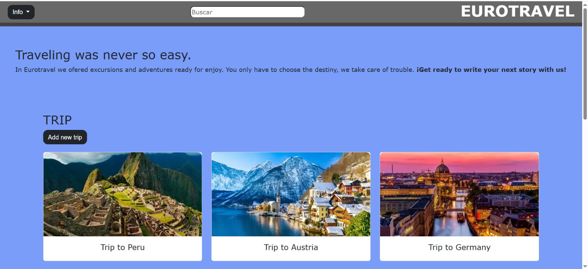
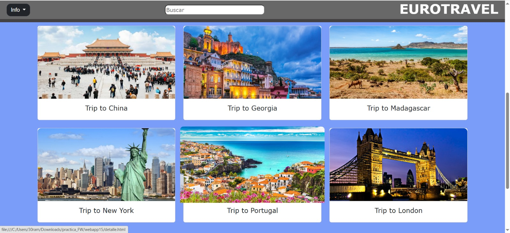
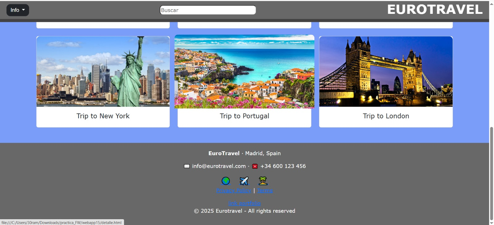
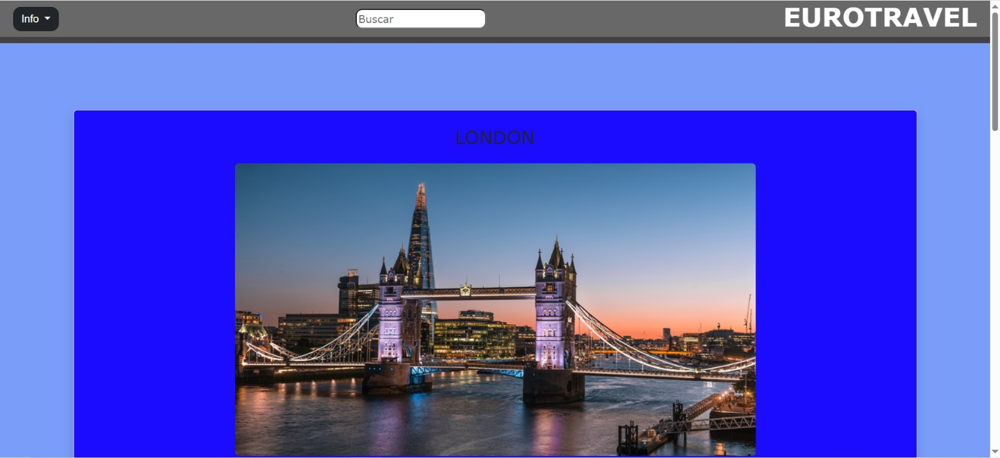
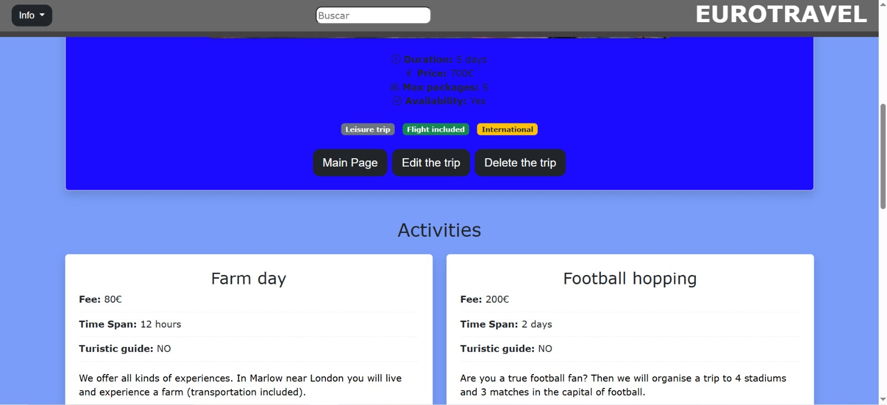
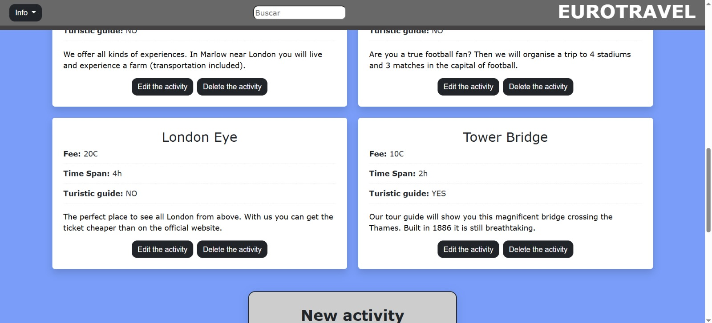
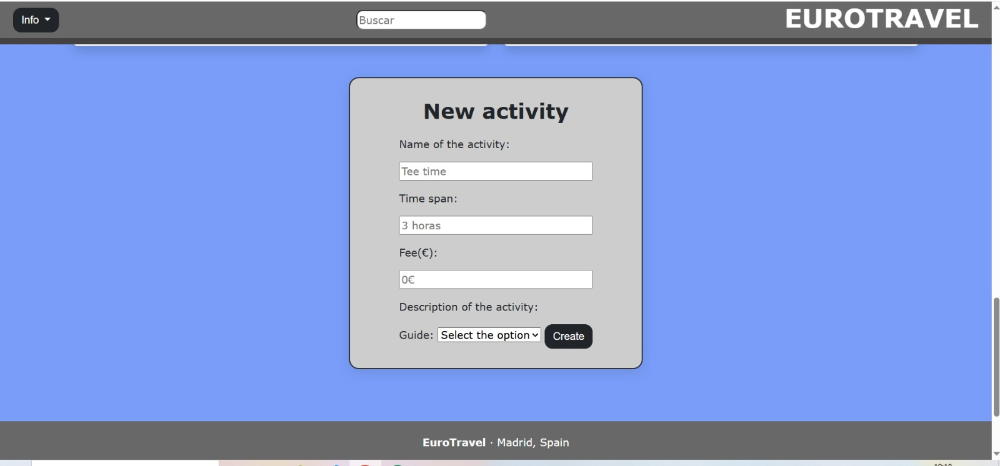
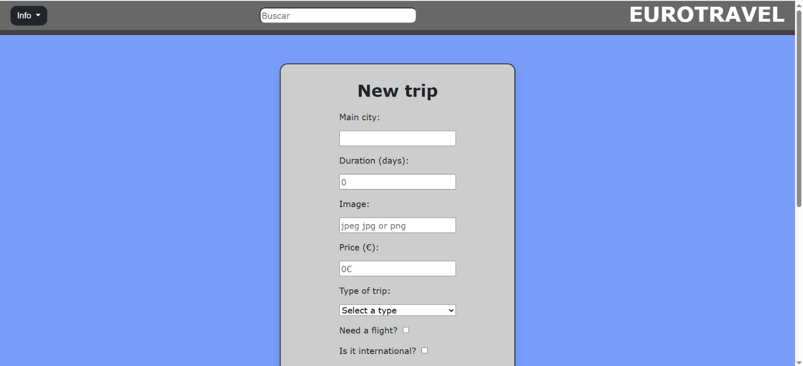
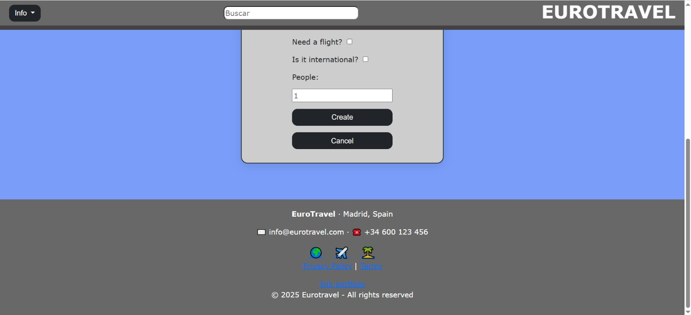
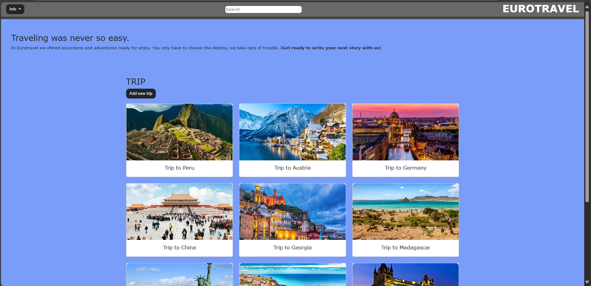

# Eurotravel
**Web Fundamentals**  
**2nd Year - Software Engineering Degree**  
**Project 2025 – 2026**

##  Development Team
| Nombre                           | Email                                          | Github Username                         |
|----------------------------------|------------------------------------------------|-----------------------------------------|
| **Raúl Martín Sánchez**          | [r.martinsa.2024@alumnos.urjc.es](mailto:r.martinsa.2024@alumnos.urjc.es) | [@raulmrtnsa](https://github.com/raulmrtnsa) |
| **Stanislaw Cherkhavskyy Pater** | [s.cherkhavskyy.2024@alumnos.urjc.es](mailto:s.cherkhavskyy.2024@alumnos.urjc.es) | [@stann15](https://github.com/stann15)   |
| **Daniel Villalón Muñoz**        | [d.villalon.2024@alumnos.urjc.es](mailto:d.villalon.2024@alumnos.urjc.es)   | [@DanielVM6](https://github.com/DanielVM6) |

## Features 

### Entities
  
#### Main entity

##### Trip 
We plan to offer a trip as base structure of our webpage selling them appart and as pack with all included. Our idea is to have a static page where the trips with all the atributtes remain the same through out all the times that people enter. The only difference is the availability, we can change it from yes to no and that way the the site will have functionality at the same time remaning simple. The relation wth the secondary one is when they have selected the trip, extra activities will pop up in order tto th costumer to buy it.

##### Attributes:
- **ID** (ID)
- **Main city**  (main_city)
- **Duration** (duration)  
- **Total Price** (price)   
- **Availability** (availability)
- **Type of trip** (t_trip) (family, leisure or cultural) 
- **Flight** (flight) (boolean)
- **National** (national) (boolean)
- **Max travellers** (max_travellers) This is the maximum number of people can choose to do this activity.
  
#### Secondary entity

##### Activity
There will be activities that you could book and add to you trip, this activities will be added to your trip and you could see the caracteristics and information of each them before booking it.

##### Attributes:
- **Name** This is the name of each that each trip offers, as it is static we plan to add one or two activities by trip. 
- **Fee** This is an aditional price aded to the price of the trip.  
- **Time span**  It indicates in the trip what is the lenght, start and end of the activity. 
- **Information** Here we describe what the trip is about.
  
### Images
Each entity or secondary entity will have an associated image so that the user can have an idea of ​​the type of trip or activity he is going to do.

### Search, Filtering, and Categorization

The system will allow:

- **Trip search** by:
  - Main city
  - Dates
  - Type of trip (family, leisure, cultural)
- **Filters**:
  - Price range
  - Duration (days)
  - Available seats
- **Categorization**:
  - National vs international trips  
  - Packages with or without flights  
  - Family, leisure or cultural

## Documentation

➡ **Images**
  -Main
  
  
  

  -Detail
    
  
  
  

  -New_trip
  
  
  

➡ **Stanislaw Cherkhavskyy Pater**
- So the main thing that I did is the detail page except the footer and the header. In the page I did the details about the main and secundary entity with all the tables, pictures and divisions. I looked up Boostrap and implemented it, also making it responsive and the hover on the shadow of the picture but the form I only adapted it so it woould be the same. The associated CSS page was also done by me. Moreover I helped on the main pages with some other small things apart from writing. Organising the page and telling how to link main and secondary entities.

- **Commits**:
  - https://github.com/CodeURJC-FW-2025-26/webapp15/commit/d3888e1086ac7a5b42cb7e27907db8913cd02221
  - https://github.com/CodeURJC-FW-2025-26/webapp15/commit/95f6814c827a3114cd276383893bd91bc6eb7111
  - https://github.com/CodeURJC-FW-2025-26/webapp15/commit/741e05a6042f41717bcb61d72006ae977663e556ç
  - (https://github.com/CodeURJC-FW-2025-26/webapp15/commit/3e736482307c127c502f577bb5e6b7f6d85fd50f) 
  - https://github.com/CodeURJC-FW-2025-26/webapp15/commit/7b35a56a37c4916d2d4b105cbd579a4a123c5961
  - https://github.com/CodeURJC-FW-2025-26/webapp15/commit/9ec6df08ac3fc6ff42786475bf23bdadb5f83884

  - List of the 5 files in which I have participated the most:
  - [detalle.html](detalle.html)
  - [main.html](main.html)
  - [style_detalle.css](style_detalle.css)
  

➡ **Daniel Villalón Muñoz**
- Throughout this project, my work has mainly consisted of taking charge of the “new element” page and its corresponding .css file with its styling.
In addition to that, I created the header for all three pages, designed the button styles, and, like my teammates, I was able to make changes to the three pages whenever a detail was missing or there was an error.

- **List of the 5 most significant commits:**
  - [all button and few style changes](https://github.com/CodeURJC-FW-2025-26/webapp15/commit/a0739c97bd9f8516bc626075517cdbd33a731894)
  - [newtravel start](https://github.com/CodeURJC-FW-2025-26/webapp15/commit/8e2102fe87071ec4442fad5a2e6f3882ba4940e0)
  - [Start of form and added dropbox to navbar](https://github.com/CodeURJC-FW-2025-26/webapp15/commit/6a3237a535c8bbd5863804825396eb8c5fe7a949)
  - [form finished](https://github.com/CodeURJC-FW-2025-26/webapp15/commit/6f0c37a7661bfc8cd89eefe55fb7380954457f26)
  - [added header](https://github.com/CodeURJC-FW-2025-26/webapp15/commit/de7d013f369011bbf81598a102a67e9b2a77c8e7)

- **List of the 5 files in which I have participated the most:**
  - [new_travel.html](new_travel.html)
  - [style_newTravel.css](style_newTravel.css)
  - [style_detalle.css](style_detalle.css)
  - [main.html](main.html)
  - [detalle.html](detalle.html)

  ➡ **Raul Martin Sanchez**
  - In this proyect, my main aportation consist of the "main" page and in the style_main.css file with the style of the page.
  - Furthermore I created the footer for the three pages , designing icons with animations and also I was able to make changes to the other pages , fixing errors if there were

  - **List of the 5 most significant commits:**
  - [Responsive update of the main page and style css update](https://github.com/CodeURJC-FW-2025-26/webapp15/commit/11808d3fbc8386e33d347347d3c16b1248b36654)
  - [Responsive footer modification](https://github.com/CodeURJC-FW-2025-26/webapp15/commit/b3cc27ce117a3a99fe6f40c54aa688a3a86ee47a)
  - [footer added and style_main modification](https://github.com/CodeURJC-FW-2025-26/webapp15/commit/be93a173329d21e9f33ee8bb22a229d598a38ebb)
  - [section of images added](https://github.com/CodeURJC-FW-2025-26/webapp15/commit/66ecbd61122cf3ef5d556bfba43661290e8fefbb)
  - [css changes to armonice the page](https://github.com/CodeURJC-FW-2025-26/webapp15/commit/a7c8b2d39f80fced6ae67c7babc3e0d3e8dca902)

  - **List of the 5 files in which I have participated the most:**
  - [main.html](main.html)
  - [style_main.css](style_main.css)
  - [detalle.html](detalle.html)
  - [new_travel.html](new_travel.html)
  - [detalle.css](detalle.css)

  